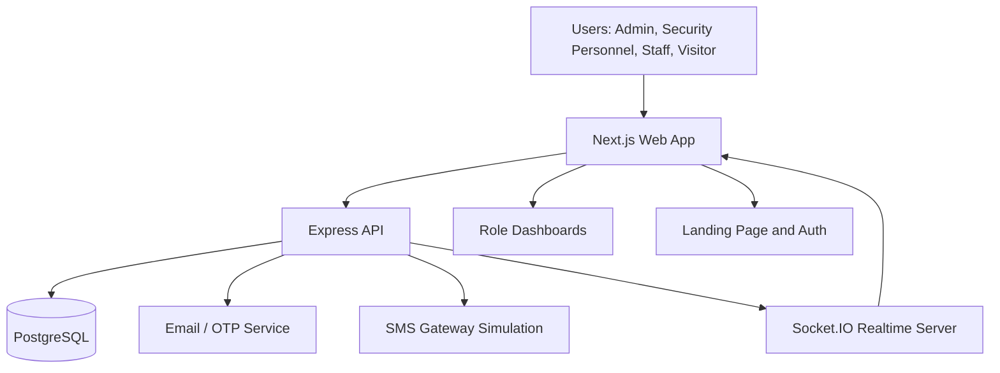

# System Architecture

## Overview

The platform is organized as a monorepo with a Next.js frontend, an Express API, a PostgreSQL database, and realtime notification support through WebSockets.

## Core Layers

- Presentation layer: landing page, authentication pages, and dashboards.
- API layer: auth, incidents, visitor access, notifications, analytics, reports, and staff management.
- Data layer: PostgreSQL schema with users, roles, incidents, visitors, alerts, messages, reports, CCTV logs, and audit logs.
- Realtime layer: Socket.IO events for alerts, notifications, and operational updates.
