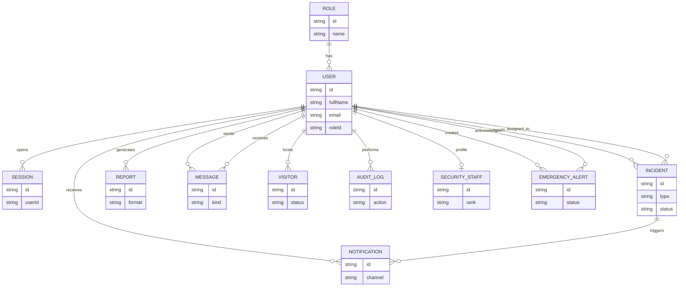

# ER Diagram

```mermaid
erDiagram
  ROLE ||--o{ USER : has
  USER ||--o{ SESSION : opens
  USER ||--o{ INCIDENT : reports
  USER ||--o{ INCIDENT : assigned_to
  USER ||--o{ NOTIFICATION : receives
  USER ||--o{ REPORT : generates
  USER ||--o{ MESSAGE : sends
  USER ||--o{ MESSAGE : receives
  USER ||--o{ VISITOR : hosts
  USER ||--o{ AUDIT_LOG : performs
  USER ||--o| SECURITY_STAFF : profile
  USER ||--o{ EMERGENCY_ALERT : creates
  USER ||--o{ EMERGENCY_ALERT : acknowledges
  INCIDENT ||--o{ NOTIFICATION : triggers

  ROLE {
    string id
    string name
  }
  USER {
    string id
    string fullName
    string email
    string roleId
  }
  SESSION {
    string id
    string userId
  }
  INCIDENT {
    string id
    string type
    string status
  }
  EMERGENCY_ALERT {
    string id
    string status
  }
  VISITOR {
    string id
    string status
  }
  SECURITY_STAFF {
    string id
    string rank
  }
  NOTIFICATION {
    string id
    string channel
  }
  REPORT {
    string id
    string format
  }
  MESSAGE {
    string id
    string kind
  }
  AUDIT_LOG {
    string id
    string action
  }
```
