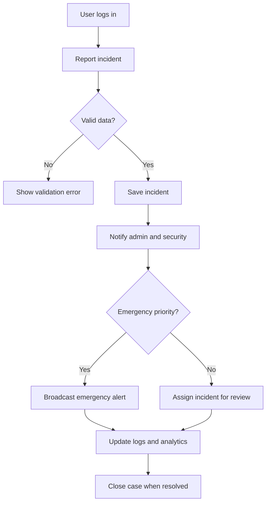

# Incident Response Flowchart

```mermaid
flowchart TD
  A[User logs in] --> B[Report incident]
  B --> C{Valid data?}
  C -- No --> D[Show validation error]
  C -- Yes --> E[Save incident]
  E --> F[Notify admin and security]
  F --> G{Emergency priority?}
  G -- Yes --> H[Broadcast emergency alert]
  G -- No --> I[Assign incident for review]
  H --> J[Update logs and analytics]
  I --> J
  J --> K[Close case when resolved]
```
