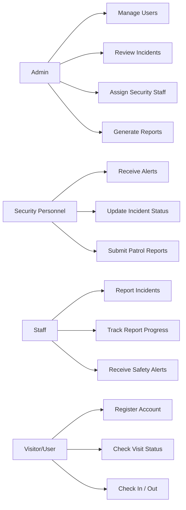

# Use Case Diagram

## Main Scenarios

- An admin monitors activity, manages users, and produces reports.
- A security officer receives emergency alerts and updates incident status.
- A staff member reports an incident and tracks the response.
- A visitor or user registers, receives a QR pass, and checks visit status.
